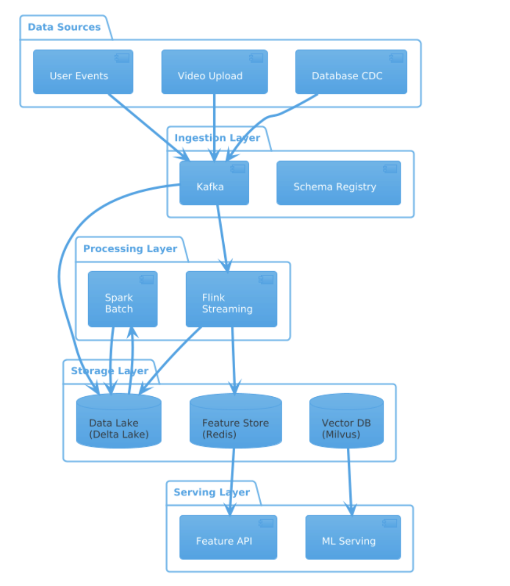

# 🎬 实时视频推荐平台 - 数据工程架构设计

## 目录
- [1️⃣ Requirement Clarification](#1️⃣-requirement-clarification)
- [2️⃣ High-Level Architecture](#2️⃣-high-level-architecture)
- [3️⃣ Ingestion Layer](#3️⃣-ingestion-layer)
- [4️⃣ Storage Layer](#4️⃣-storage-layer)
- [5️⃣ Processing Layer](#5️⃣-processing-layer)
- [6️⃣ Serving Layer](#6️⃣-serving-layer)
- [7️⃣ Scalability](#7️⃣-scalability)
- [8️⃣ Reliability](#8️⃣-reliability)
- [9️⃣ Data Quality & Governance](#9️⃣-data-quality--governance)
- [🔟 Cost Optimization](#🔟-cost-optimization)


---

## 1️⃣ Requirement Clarification

### 1.1 Functional Requirements

| 问题 | 回答 |
|------|------|
| **What problem are we solving?** | 构建一个类似抖音的短视频平台，支持：<br/>• 用户刷视频时获得个性化实时推荐<br/>• 用户上传视频后自动进行 AI 分析和入库<br/>• 支持 ML 模型训练和实时推理 |
| **Batch or Streaming?** | **Both (Lambda Architecture)**<br/>• Streaming: 用户行为实时处理、实时特征更新<br/>• Batch: 模型训练、历史特征回填、报表生成 |
| **Who are the consumers?** | • **Recommendation Service**: 实时推荐 API<br/>• **ML Platform**: 模型训练 Pipeline<br/>• **BI Team**: 业务分析和报表<br/>• **Content Moderation**: 内容审核系统 |
| **What queries are expected?** | • 获取用户实时特征 (点查, <10ms)<br/>• 向量相似度搜索 (ANN, <20ms)<br/>• 历史行为聚合分析 (OLAP)<br/>• 训练数据采样 (批量读取) |
| **Do we need ML support?** | ✅ Yes<br/>• Feature Store 支持在线/离线特征一致性<br/>• 训练数据 Pipeline<br/>• Embedding 存储和检索 |

### 1.2 Non-Functional Requirements

| 维度 | 要求 | 说明 |
|------|------|------|
| **Data Volume** | ~10B events/day | 日活 1 亿用户，人均 100 次行为事件 |
| **Latency** | P99 < 100ms (实时特征) | 推荐 API 总延迟 < 100ms，特征获取 < 10ms |
| **Throughput** | ~500K events/sec (峰值) | 晚高峰流量是平均的 3-5 倍 |
| **Availability** | 99.99% | 每月最多 4.3 分钟停机 |
| **Consistency** | Eventual Consistency | 特征更新可接受秒级延迟 |
| **Compliance** | GDPR, 用户数据可删除 | 支持用户数据删除请求 |

---

## 2️⃣ High-Level Architecture

```
┌─────────────────────────────────────────────────────────────────────────────┐
│                        Real-Time Video Recommendation Platform               │
└─────────────────────────────────────────────────────────────────────────────┘

┌─────────────────────────────────────────────────────────────────────────────┐
│                              DATA SOURCES                                    │
│  ┌─────────────┐  ┌─────────────┐  ┌─────────────┐  ┌─────────────┐        │
│  │ User Events │  │ Video Upload│  │  Database   │  │  External   │        │
│  │ (Click/View)│  │ (S3 + Meta) │  │   (CDC)     │  │    API      │        │
│  └──────┬──────┘  └──────┬──────┘  └──────┬──────┘  └──────┬──────┘        │
└─────────┼────────────────┼────────────────┼────────────────┼────────────────┘
          │                │                │                │
          ▼                ▼                ▼                ▼
┌─────────────────────────────────────────────────────────────────────────────┐
│                            INGESTION LAYER                                   │
│  ┌─────────────────────────────────────────────────────────────────────┐   │
│  │                      Apache Kafka + Schema Registry                  │   │
│  │  ┌──────────────┐ ┌──────────────┐ ┌──────────────┐ ┌────────────┐  │   │
│  │  │events.user.  │ │events.video. │ │events.cdc.   │ │events.     │  │   │
│  │  │behavior      │ │upload        │ │changes       │ │external    │  │   │
│  │  └──────────────┘ └──────────────┘ └──────────────┘ └────────────┘  │   │
│  └─────────────────────────────────────────────────────────────────────┘   │
└─────────────────────────────────────────────────────────────────────────────┘
          │                │                │                │
          ▼                ▼                ▼                ▼
┌─────────────────────────────────────────────────────────────────────────────┐
│                             STORAGE LAYER                                    │
│                                                                             │
│  ┌─────────────────────────────────────────────────────────────────────┐   │
│  │                    Data Lakehouse (Delta Lake on S3)                 │   │
│  │  ┌──────────────┐  ┌──────────────┐  ┌──────────────┐               │   │
│  │  │  Raw Layer   │─▶│ Clean Layer  │─▶│  Gold Layer  │               │   │
│  │  │  (Bronze)    │  │  (Silver)    │  │  (Curated)   │               │   │
│  │  └──────────────┘  └──────────────┘  └──────────────┘               │   │
│  └─────────────────────────────────────────────────────────────────────┘   │
│                                                                             │
│  ┌─────────────┐  ┌─────────────┐  ┌─────────────┐  ┌─────────────┐       │
│  │   Redis     │  │   Milvus    │  │ PostgreSQL  │  │  MLflow     │       │
│  │ (Features)  │  │  (Vectors)  │  │ (Metadata)  │  │ (Models)    │       │
│  └─────────────┘  └─────────────┘  └─────────────┘  └─────────────┘       │
└─────────────────────────────────────────────────────────────────────────────┘
          │                │                │                │
          ▼                ▼                ▼                ▼
┌─────────────────────────────────────────────────────────────────────────────┐
│                           PROCESSING LAYER                                   │
│                                                                             │
│  ┌────────────────────────────┐    ┌────────────────────────────┐          │
│  │     Streaming (Flink)      │    │      Batch (Spark)         │          │
│  │  • Real-time features      │    │  • Model training data     │          │
│  │  • Event enrichment        │    │  • Feature backfill        │          │
│  │  • Window aggregation      │    │  • Data quality jobs       │          │
│  └────────────────────────────┘    └────────────────────────────┘          │
│                                                                             │
│  ┌────────────────────────────┐    ┌────────────────────────────┐          │
│  │    Video AI Pipeline       │    │    ML Training Pipeline    │          │
│  │  • Transcoding             │    │  • Sample data             │          │
│  │  • CLIP Embedding          │    │  • Train models            │          │
│  │  • Scene Classification    │    │  • Register to MLflow      │          │
│  └────────────────────────────┘    └────────────────────────────┘          │
└─────────────────────────────────────────────────────────────────────────────┘
          │                │                │                │
          ▼                ▼                ▼                ▼
┌─────────────────────────────────────────────────────────────────────────────┐
│                            SERVING LAYER                                     │
│                                                                             │
│  ┌─────────────┐  ┌─────────────┐  ┌─────────────┐  ┌─────────────┐       │
│  │  Feature    │  │   Vector    │  │   Model     │  │    OLAP     │       │
│  │  Serving    │  │   Search    │  │   Serving   │  │   Engine    │       │
│  │  (Feast)    │  │  (Milvus)   │  │  (Triton)   │  │ (ClickHouse)│       │
│  └─────────────┘  └─────────────┘  └─────────────┘  └─────────────┘       │
└─────────────────────────────────────────────────────────────────────────────┘
          │                │                │                │
          ▼                ▼                ▼                ▼
┌─────────────────────────────────────────────────────────────────────────────┐
│                              CONSUMERS                                       │
│  ┌─────────────┐  ┌─────────────┐  ┌─────────────┐  ┌─────────────┐       │
│  │Recommendation│  │ ML Platform │  │  BI / Data  │  │  Content    │       │
│  │  Service    │  │  (Training) │  │   Analysts  │  │ Moderation  │       │
│  └─────────────┘  └─────────────┘  └─────────────┘  └─────────────┘       │
└─────────────────────────────────────────────────────────────────────────────┘
```

```
┌─────────────────────────────────────────────────────────────────────────────┐
│                 Video Recommendation Platform - BPMN Style                   │
├─────────────────────────────────────────────────────────────────────────────┤
│                                                                             │
│  ┌─ DATA SOURCES ───────────────────────────────────────────────────────┐  │
│  │                                                                       │  │
│  │   (○)──▶[User Event]    (○)──▶[Video Upload]    (○)──▶[DB Change]   │  │
│  │         Client SDK            S3 Upload              CDC             │  │
│  └───────────┬───────────────────────┬────────────────────┬─────────────┘  │
│              │                       │                    │                 │
│              ▼                       ▼                    ▼                 │
│  ┌─ INGESTION ──────────────────────────────────────────────────────────┐  │
│  │                                                                       │  │
│  │              ┌─────────────────────────────────────┐                 │  │
│  │              │         ((Kafka Topics))            │                 │  │
│  │              │  user.events │ video.upload │ cdc   │                 │  │
│  │              └─────────────────────────────────────┘                 │  │
│  │                              │                                        │  │
│  └──────────────────────────────┼────────────────────────────────────────┘  │
│                                 │                                           │
│              ┌──────────────────┼──────────────────┐                       │
│              ▼                  ▼                  ▼                       │
│  ┌─ PROCESSING ─────────────────────────────────────────────────────────┐  │
│  │                                                                       │  │
│  │   (✉)──▶[Flink]──▶ Realtime Features    (◷)──▶[Spark]──▶ Batch ETL  │  │
│  │         Streaming                              Daily Jobs            │  │
│  │                                                                       │  │
│  └───────────┬──────────────────────────────────────┬────────────────────┘  │
│              │                                      │                       │
│              ▼                                      ▼                       │
│  ┌─ STORAGE ────────────────────────────────────────────────────────────┐  │
│  │                                                                       │  │
│  │   ((Redis))          ((Milvus))          ((Delta Lake))              │  │
│  │   Feature Store      Vector DB           Data Lake                   │  │
│  │                                          Bronze→Silver→Gold          │  │
│  │                                                                       │  │
│  └───────────┬──────────────────┬───────────────────┬────────────────────┘  │
│              │                  │                   │                       │
│              ▼                  ▼                   ▼                       │
│  ┌─ SERVING ────────────────────────────────────────────────────────────┐  │
│  │                                                                       │  │
│  │   [Feature API]      [ML Serving]        [OLAP Engine]               │  │
│  │      Feast             Triton             ClickHouse                 │  │
│  │                                                                       │  │
│  └───────────┬──────────────────┬───────────────────┬────────────────────┘  │
│              │                  │                   │                       │
│              ▼                  ▼                   ▼                       │
│  ┌─ CONSUMERS ──────────────────────────────────────────────────────────┐  │
│  │                                                                       │  │
│  │   [Rec Service]      [ML Platform]       [BI / Analysts]             │  │
│  │                                                                       │  │
│  └───────────────────────────────────────────────────────────────────────┘  │
│                                                                             │
├─────────────────────────────────────────────────────────────────────────────┤
│  LEGEND:                                                                    │
│  (○) = Start Event (HTTP/Trigger)    (✉) = Message Event (Kafka)           │
│  (◷) = Timer Event (Scheduled)       [  ] = Task/Service                   │
│  (( )) = Data Store                   ──▶ = Data Flow                      │
└─────────────────────────────────────────────────────────────────────────────┘
```

---

## 3️⃣ Ingestion Layer

### 3.1 数据来源

| 数据源 | 类型 | 数据量 | 摄取方式 |
|--------|------|--------|----------|
| **User Events** | 用户行为日志 | ~500K/sec | Streaming (Kafka) |
| **Video Upload** | 视频文件 + 元数据 | ~1M videos/day | S3 Event → Kafka |
| **Database (CDC)** | 用户/视频主数据 | ~10K changes/sec | Debezium → Kafka |
| **External API** | 第三方数据 (版权等) | ~1K/sec | Webhook → Kafka |

### 3.2 摄取方式详解

```
┌─────────────────────────────────────────────────────────────────────────────┐
│                           Ingestion Patterns                                 │
├─────────────────────────────────────────────────────────────────────────────┤
│                                                                             │
│  1. STREAMING: User Events                                                  │
│  ─────────────────────────────                                              │
│                                                                             │
│     Client SDK                                                              │
│         │                                                                   │
│         │ HTTP POST /events                                                 │
│         ▼                                                                   │
│     ┌─────────────┐     ┌─────────────┐     ┌─────────────┐                │
│     │ Ingestion   │────▶│   Schema    │────▶│   Kafka     │                │
│     │ API (Go)    │     │  Registry   │     │   Topic     │                │
│     │             │     │  (Avro)     │     │             │                │
│     │ • Auth      │     │             │     │ Partitioned │                │
│     │ • Rate Limit│     │ • Validate  │     │ by user_id  │                │
│     │ • Basic Val │     │ • Version   │     │             │                │
│     └─────────────┘     └─────────────┘     └─────────────┘                │
│                                                                             │
│                                                                             │
│  2. CDC: Database Changes                                                   │
│  ─────────────────────────                                                  │
│                                                                             │
│     ┌─────────────┐     ┌─────────────┐     ┌─────────────┐                │
│     │ PostgreSQL  │────▶│  Debezium   │────▶│   Kafka     │                │
│     │             │ WAL │  Connector  │     │   Topic     │                │
│     │ • users     │     │             │     │             │                │
│     │ • videos    │     │ • Snapshot  │     │ events.cdc. │                │
│     │ • creators  │     │ • Stream    │     │ changes     │                │
│     └─────────────┘     └─────────────┘     └─────────────┘                │
│                                                                             │
│                                                                             │
│  3. FILE UPLOAD: Videos                                                     │
│  ───────────────────────                                                    │
│                                                                             │
│     Client                                                                  │
│         │                                                                   │
│         │ Presigned URL Upload                                              │
│         ▼                                                                   │
│     ┌─────────────┐     ┌─────────────┐     ┌─────────────┐                │
│     │     S3      │────▶│   Lambda    │────▶│   Kafka     │                │
│     │   Bucket    │ S3  │   Bridge    │     │   Topic     │                │
│     │             │Event│             │     │             │                │
│     │ raw-videos/ │     │ • Parse S3  │     │ events.video│                │
│     │             │     │ • Publish   │     │ .upload     │                │
│     └─────────────┘     └─────────────┘     └─────────────┘                │
│                                                                             │
└─────────────────────────────────────────────────────────────────────────────┘
```

### 3.3 关键设计点

| 设计点 | 实现方案 | 说明 |
|--------|----------|------|
| **Partition Strategy** | 按 `user_id` 分区 | 保证同一用户事件有序，便于窗口聚合 |
| **Idempotency** | `event_id` 去重 | Producer 设置 `enable.idempotence=true` |
| **Exactly-once** | Kafka Transactions | 结合 Flink checkpoint 实现端到端一致性 |
| **Backpressure** | Kafka Consumer lag 监控 | 动态调整 Flink 并行度 |
| **Schema Registry** | Confluent Schema Registry + Avro | Schema 版本管理，向后兼容检查 |

### 3.4 Kafka Topic 设计

```yaml
# Topic: events.user.behavior
partitions: 128              # 按用户量和吞吐量计算
replication_factor: 3        # 高可用
retention.ms: 604800000      # 7 天
cleanup.policy: delete
compression.type: lz4        # 平衡压缩率和 CPU

# Topic: events.video.upload  
partitions: 32               # 上传量相对较少
replication_factor: 3
retention.ms: 259200000      # 3 天

# Partition Key 选择
events.user.behavior  → user_id (保证用户事件有序)
events.video.upload   → video_id
events.cdc.changes    → primary_key
```

> 💡 **加分句**: "I'd partition Kafka topics by user_id to ensure ordering guarantees for the same user's events, which is critical for accurate session-based feature computation."

---

## 4️⃣ Storage Layer

### 4.1 分层设计 (Medallion Architecture)

```
┌─────────────────────────────────────────────────────────────────────────────┐
│                    Data Lakehouse: Medallion Architecture                    │
├─────────────────────────────────────────────────────────────────────────────┤
│                                                                             │
│  ┌───────────────────┐    ┌───────────────────┐    ┌───────────────────┐   │
│  │    RAW (Bronze)   │───▶│   CLEAN (Silver)  │───▶│   GOLD (Curated)  │   │
│  │                   │    │                   │    │                   │   │
│  │ • 原始事件        │    │ • 去重            │    │ • 聚合特征表      │   │
│  │ • Schema 可变     │    │ • Schema 标准化   │    │ • 宽表            │   │
│  │ • Append-only     │    │ • 数据质量校验    │    │ • 维度建模        │   │
│  │ • 保留 7-30 天    │    │ • 关联补充        │    │ • ML 训练数据     │   │
│  │                   │    │ • 保留 90 天      │    │ • 长期保留        │   │
│  └───────────────────┘    └───────────────────┘    └───────────────────┘   │
│                                                                             │
│  存储格式: Delta Lake (Parquet + Transaction Log)                          │
│  存储位置: S3 (s3://data-lake/{layer}/{domain}/{table}/)                   │
│                                                                             │
└─────────────────────────────────────────────────────────────────────────────┘
```
test env?
staging env?

### 4.2 各层表设计

#### Bronze Layer (Raw)
```sql
-- 原始用户事件
CREATE TABLE bronze.user_events (
    event_id        STRING,
    user_id         STRING,
    event_type      STRING,
    video_id        STRING,
    timestamp       TIMESTAMP,
    device_type     STRING,
    session_id      STRING,
    raw_payload     STRING,      -- 保留原始 JSON
    _ingestion_time TIMESTAMP,   -- 摄入时间
    _kafka_offset   BIGINT       -- Kafka offset (用于回溯)
)
USING DELTA
PARTITIONED BY (date(timestamp))
LOCATION 's3://data-lake/bronze/events/user_events/'
TBLPROPERTIES (
    'delta.autoOptimize.optimizeWrite' = 'true',
    'delta.autoOptimize.autoCompact' = 'true'
);
```

#### Silver Layer (Clean)
```sql
-- 清洗后的用户事件
CREATE TABLE silver.user_events (
    event_id        STRING,
    user_id         STRING,
    event_type      STRING,
    video_id        STRING,
    timestamp       TIMESTAMP,
    device_type     STRING,
    session_id      STRING,
    -- 补充的维度
    user_country    STRING,
    video_category  STRING,
    creator_id      STRING,
    -- 数据质量标记
    _is_valid       BOOLEAN,
    _processed_time TIMESTAMP
)
USING DELTA
PARTITIONED BY (event_date DATE, event_hour INT)
LOCATION 's3://data-lake/silver/events/user_events/'
TBLPROPERTIES (
    'delta.autoOptimize.optimizeWrite' = 'true'
);
```

#### Gold Layer (Curated)
```sql
-- 用户特征聚合表 (供 ML 训练)
CREATE TABLE gold.user_features_daily (
    user_id                 STRING,
    feature_date            DATE,
    -- 行为统计
    watch_count_1d          INT,
    watch_duration_1d       BIGINT,
    like_count_1d           INT,
    share_count_1d          INT,
    -- 偏好特征
    top_category_1d         STRING,
    avg_video_duration_1d   DOUBLE,
    active_hours_1d         ARRAY<INT>,
    -- 长期特征
    watch_count_7d          INT,
    watch_count_30d         INT,
    ltv_score               DOUBLE
)
USING DELTA
PARTITIONED BY (feature_date)
LOCATION 's3://data-lake/gold/features/user_features_daily/'
TBLPROPERTIES (
    'delta.enableChangeDataFeed' = 'true'  -- 支持增量读取
);
```

### 4.3 存储选型

| 存储类型 | 技术选型 | 使用场景 | 数据特点 |
|----------|----------|----------|----------|
| **Data Lakehouse** | Delta Lake on S3 | 历史数据、ML 训练 | 大容量、批处理 |
| **Feature Store** | Feast + Redis | 实时特征服务 | 低延迟点查 |
| **Vector DB** | Milvus | Embedding 检索 | ANN 搜索 |
| **OLTP** | PostgreSQL | 元数据、配置 | 事务性写入 |
| **OLAP** | ClickHouse | BI 报表 | 实时分析 |
| **Model Registry** | MLflow | 模型版本管理 | 模型元数据 |

### 4.4 关键优化点

| 优化点 | 实现方案 | 效果 |
|--------|----------|------|
| **Partitioning** | 按 `event_date` + `event_hour` | 查询剪枝，减少扫描 |
| **Z-Order** | 按 `user_id`, `video_id` | 高频过滤列数据聚集 |
| **Compaction** | Auto Optimize + 每日 OPTIMIZE | 合并小文件 |
| **Small Files** | `autoCompact` + 目标文件 128MB | 避免小文件问题 |
| **ACID** | Delta Lake Transaction Log | 支持 UPSERT, Time Travel |

```sql
-- Z-Order 优化示例
OPTIMIZE silver.user_events
ZORDER BY (user_id, video_id);

-- 定期清理旧版本
VACUUM silver.user_events RETAIN 168 HOURS;
```

---

## 5️⃣ Processing Layer

### 5.1 Streaming Processing (Flink)

```
┌─────────────────────────────────────────────────────────────────────────────┐
│                      Flink Streaming Jobs                                    │
├─────────────────────────────────────────────────────────────────────────────┤
│                                                                             │
│  Job 1: Real-time Feature Computation                                       │
│  ────────────────────────────────────                                       │
│                                                                             │
│  Kafka Source                                                               │
│      │                                                                      │
│      ▼                                                                      │
│  ┌─────────────┐    ┌─────────────┐    ┌─────────────┐    ┌─────────────┐ │
│  │   Parse &   │───▶│   Enrich    │───▶│  Sliding    │───▶│   Sink to   │ │
│  │  Validate   │    │   (Async)   │    │  Window     │    │   Redis     │ │
│  │             │    │             │    │             │    │             │ │
│  │ • Avro解析  │    │ • 用户信息  │    │ • 5min窗口  │    │ • 特征写入  │ │
│  │ • Schema校验│    │ • 视频信息  │    │ • 聚合计算  │    │ • TTL设置   │ │
│  │ • 过滤无效  │    │ • Broadcast │    │ • 增量更新  │    │             │ │
│  └─────────────┘    └─────────────┘    └─────────────┘    └─────────────┘ │
│         │                                                                   │
│         ▼                                                                   │
│      DLQ Sink (无效事件)                                                    │
│                                                                             │
│                                                                             │
│  Job 2: CDC Processing                                                      │
│  ─────────────────────                                                      │
│                                                                             │
│  Kafka CDC Source ──▶ Parse ──▶ Route ──┬──▶ Update Feature Store          │
│                                         └──▶ Sync to Data Lake              │
│                                                                             │
└─────────────────────────────────────────────────────────────────────────────┘
```

**Flink 代码示例**:
```java
// 实时特征计算
DataStream<UserFeature> features = userEvents
    .keyBy(event -> event.getUserId())
    .window(SlidingEventTimeWindows.of(Time.minutes(5), Time.minutes(1)))
    .aggregate(new UserFeatureAggregator())
    .name("5min-sliding-window-aggregation");

// Async I/O 补充用户信息 (避免阻塞)
DataStream<EnrichedEvent> enriched = AsyncDataStream
    .unorderedWait(
        events,
        new AsyncUserInfoLookup(redisClient),
        1000, TimeUnit.MILLISECONDS,
        100  // 并发请求数
    )
    .name("async-user-enrichment");

// Checkpoint 配置 (Exactly-once)
env.enableCheckpointing(60000);  // 1 分钟
env.getCheckpointConfig().setCheckpointingMode(CheckpointingMode.EXACTLY_ONCE);
env.getCheckpointConfig().setMinPauseBetweenCheckpoints(30000);
```

### 5.2 Batch Processing (Spark)

```
┌─────────────────────────────────────────────────────────────────────────────┐
│                         Spark Batch Jobs                                     │
├─────────────────────────────────────────────────────────────────────────────┤
│                                                                             │
│  Job 1: Daily Feature Backfill (Airflow DAG)                                │
│  ───────────────────────────────────────────                                │
│                                                                             │
│  Schedule: 每天 03:00 UTC                                                   │
│                                                                             │
│  ┌─────────────┐    ┌─────────────┐    ┌─────────────┐    ┌─────────────┐ │
│  │  Read       │───▶│  Transform  │───▶│  Aggregate  │───▶│   Write     │ │
│  │  Silver     │    │             │    │             │    │   Gold      │ │
│  │             │    │ • 数据清洗  │    │ • 1d/7d/30d │    │             │ │
│  │ 增量读取    │    │ • 类型转换  │    │ • 特征计算  │    │ • MERGE     │ │
│  │ (CDC Feed)  │    │             │    │             │    │ • 分区写入  │ │
│  └─────────────┘    └─────────────┘    └─────────────┘    └─────────────┘ │
│                                                                             │
│                                                                             │
│  Job 2: ML Training Data Preparation                                        │
│  ───────────────────────────────────                                        │
│                                                                             │
│  ┌─────────────┐    ┌─────────────┐    ┌─────────────┐    ┌─────────────┐ │
│  │  Sample     │───▶│  Join       │───▶│  Label      │───▶│   Export    │ │
│  │  Events     │    │  Features   │    │  Generate   │    │   to S3     │ │
│  │             │    │             │    │             │    │             │ │
│  │ 负采样      │    │ User + Item │    │ Click=1     │    │ Parquet     │ │
│  │ 时间窗口    │    │ 特征拼接    │    │ NoClick=0   │    │ 分区存储    │ │
│  └─────────────┘    └─────────────┘    └─────────────┘    └─────────────┘ │
│                                                                             │
└─────────────────────────────────────────────────────────────────────────────┘
```

**Spark 优化配置**:
```python
spark = SparkSession.builder \
    .config("spark.sql.adaptive.enabled", "true") \          # AQE 自适应执行
    .config("spark.sql.adaptive.coalescePartitions.enabled", "true") \
    .config("spark.sql.adaptive.skewJoin.enabled", "true") \ # 倾斜 Join 优化
    .config("spark.sql.shuffle.partitions", "auto") \        # 自动分区
    .config("spark.sql.files.maxPartitionBytes", "128m") \   # 分区大小
    .getOrCreate()

# Broadcast Join (小表广播)
user_dim = spark.read.table("dim.users")  # 小表
events = spark.read.table("silver.user_events")

# 当 user_dim < 10MB 时自动 Broadcast
result = events.join(broadcast(user_dim), "user_id")
```

### 5.3 关键优化点

| 优化点 | Streaming (Flink) | Batch (Spark) |
|--------|-------------------|---------------|
| **Shuffle** | 按 user_id keyBy 减少 shuffle | AQE 自动优化 shuffle 分区 |
| **State** | RocksDB state backend | - |
| **Join** | Broadcast State (小表) | Broadcast Join + Sort-Merge Join |
| **Window** | Sliding Window + Watermark | Window Functions |
| **Checkpoint** | 1min interval, exactly-once | Structured Streaming checkpoint |

> 💡 **加分句**: "Shuffle defines stage boundaries and is one of the most expensive operations, so I would optimize partition size, enable AQE for automatic shuffle partition coalescing, and use broadcast joins for dimension tables under 10MB."

---

## 6️⃣ Serving Layer

### 6.1 根据场景选型

| 场景 | 技术选型 | 访问模式 | 延迟要求 |
|------|----------|----------|----------|
| **Real-time Features** | Feast + Redis Cluster | 点查 by user_id | <10ms |
| **Vector Search** | Milvus | ANN by embedding | <20ms |
| **ML Model Serving** | Triton Inference Server | gRPC 推理 | <20ms |
| **BI / Analytics** | ClickHouse | OLAP 聚合查询 | <1s |
| **Ad-hoc Query** | Trino / Athena | SQL on Data Lake | 秒级~分钟级 |

### 6.2 Feature Serving (Feast)

```python
# Feature Store 定义
from feast import Entity, Feature, FeatureView, FileSource

user = Entity(name="user_id", value_type=ValueType.STRING)

user_features = FeatureView(
    name="user_features",
    entities=["user_id"],
    ttl=timedelta(days=1),
    features=[
        Feature(name="watch_count_1d", dtype=ValueType.INT64),
        Feature(name="like_count_1d", dtype=ValueType.INT64),
        Feature(name="top_category_1d", dtype=ValueType.STRING),
    ],
    online=True,   # 同步到 Redis
    batch_source=FileSource(
        path="s3://data-lake/gold/features/user_features_daily/",
        event_timestamp_column="feature_date"
    )
)

# 在线获取特征 (<10ms)
features = store.get_online_features(
    features=["user_features:watch_count_1d", "user_features:like_count_1d"],
    entity_rows=[{"user_id": "u_12345"}]
).to_dict()
```

### 6.3 关键优化点

| 优化点 | 实现方案 |
|--------|----------|
| **Pre-aggregation** | Gold 层预计算聚合特征，减少在线计算 |
| **Caching** | Redis Cluster 作为在线特征缓存 |
| **Indexing** | Milvus HNSW 索引加速向量搜索 |
| **Read Replicas** | Redis 读写分离，多副本承载高 QPS |

---

## 7️⃣ Scalability

### 7.1 水平扩展策略

```
┌─────────────────────────────────────────────────────────────────────────────┐
│                         Scalability Design                                   │
├─────────────────────────────────────────────────────────────────────────────┤
│                                                                             │
│  1. Kafka: Partition-based Scaling                                          │
│  ─────────────────────────────────                                          │
│  • 128 partitions → 可支持 128 个并行 consumer                              │
│  • 扩容: 增加 partition + rebalance consumer group                          │
│                                                                             │
│  2. Flink: Task Parallelism                                                 │
│  ─────────────────────────────                                              │
│  • parallelism = Kafka partitions (128)                                     │
│  • 扩容: 增加 TaskManager pods, 调整 parallelism                            │
│  • 自动扩缩容: K8s HPA based on Kafka lag                                   │
│                                                                             │
│  3. Redis: Cluster Mode                                                     │
│  ─────────────────────────                                                  │
│  • 16384 hash slots 分布在 N 个 master                                      │
│  • 扩容: 增加 master 节点, reshard slots                                    │
│                                                                             │
│  4. Milvus: Sharding                                                        │
│  ────────────────────────                                                   │
│  • Collection 按 shard_num 分片                                             │
│  • 扩容: 增加 QueryNode, 重新 load segments                                 │
│                                                                             │
└─────────────────────────────────────────────────────────────────────────────┘
```

### 7.2 Data Skew 处理

```python
# 问题: 热门用户/视频导致数据倾斜
# 解决: Salting (加盐)

# 原始 Key: user_id (某些大 V 数据量巨大)
# Salted Key: user_id + "_" + random(0, 9)

def salted_key(user_id, salt_buckets=10):
    salt = hash(user_id) % salt_buckets
    return f"{user_id}_{salt}"

# Flink 中的实现
events
    .map(lambda e: (salted_key(e.user_id), e))
    .keyBy(lambda x: x[0])
    .window(...)
    .aggregate(...)
    .map(lambda x: (original_key(x[0]), x[1]))  # 还原
    .keyBy(lambda x: x[0])
    .reduce(...)  # 合并
```

---

## 8️⃣ Reliability

### 8.1 容错机制

```
┌─────────────────────────────────────────────────────────────────────────────┐
│                         Reliability Design                                   │
├─────────────────────────────────────────────────────────────────────────────┤
│                                                                             │
│  1. Retry Mechanism                                                         │
│  ─────────────────────                                                      │
│  • Kafka Producer: retries=3, retry.backoff.ms=1000                         │
│  • Flink: restart-strategy=exponential-delay                                │
│  • API: Circuit Breaker (Resilience4j)                                      │
│                                                                             │
│  2. Dead Letter Queue (DLQ)                                                 │
│  ─────────────────────────────                                              │
│  ┌─────────┐     ┌─────────┐     ┌─────────┐                               │
│  │ Process │──X──│  Retry  │──X──│   DLQ   │                               │
│  │  Event  │     │ 3 times │     │  Topic  │                               │
│  └─────────┘     └─────────┘     └─────────┘                               │
│                                       │                                     │
│                                       ▼                                     │
│                               Manual Review / Replay                        │
│                                                                             │
│  3. Checkpointing (Flink)                                                   │
│  ─────────────────────────                                                  │
│  • Mode: EXACTLY_ONCE                                                       │
│  • Interval: 60 seconds                                                     │
│  • Backend: RocksDB (for large state)                                       │
│  • Storage: S3 (durable)                                                    │
│                                                                             │
│  4. Multi-AZ Deployment                                                     │
│  ───────────────────────                                                    │
│  • Kafka: 3 brokers across 3 AZs, replication=3                             │
│  • Redis: Cluster with replicas in different AZs                            │
│  • Flink: K8s pods spread across AZs (pod anti-affinity)                    │
│                                                                             │
└─────────────────────────────────────────────────────────────────────────────┘
```

### 8.2 监控告警

| 指标 | 阈值 | 告警级别 |
|------|------|---------|
| Kafka Consumer Lag | > 100K messages | P1 |
| Flink Checkpoint Duration | > 60s | P2 |
| Feature Freshness | > 5min 未更新 | P2 |
| Redis Latency P99 | > 10ms | P2 |
| Data Lake Job Failure | 连续 2 次失败 | P1 |

---

## 9️⃣ Data Quality & Governance

### 9.1 数据质量检查

```python
# Great Expectations 数据质量检查
import great_expectations as ge

# 定义期望
expectation_suite = {
    "expectations": [
        # 完整性检查
        {"expectation_type": "expect_column_to_exist", "kwargs": {"column": "user_id"}},
        {"expectation_type": "expect_column_values_to_not_be_null", "kwargs": {"column": "user_id"}},
        
        # 有效性检查
        {"expectation_type": "expect_column_values_to_be_in_set", 
         "kwargs": {"column": "event_type", "value_set": ["click", "view", "like", "share"]}},
        
        # 一致性检查
        {"expectation_type": "expect_column_values_to_be_between",
         "kwargs": {"column": "watch_duration", "min_value": 0, "max_value": 86400}},
        
        # 时效性检查
        {"expectation_type": "expect_column_max_to_be_between",
         "kwargs": {"column": "event_time", "min_value": "now - 1 hour"}}
    ]
}
```

### 9.2 数据治理

| 治理项 | 实现方案 |
|--------|----------|
| **Schema Validation** | Schema Registry + Avro |
| **Data Lineage** | OpenLineage + Marquez |
| **Data Catalog** | DataHub / AWS Glue Catalog |
| **RBAC** | Apache Ranger / Lake Formation |
| **PII Masking** | SHA256 hash for user_id in logs |
| **Data Retention** | TTL policies per layer |

### 9.3 血缘追踪

```
┌─────────────────────────────────────────────────────────────────────────────┐
│                           Data Lineage                                       │
├─────────────────────────────────────────────────────────────────────────────┤
│                                                                             │
│  Kafka: events.user.behavior                                                │
│          │                                                                  │
│          ▼                                                                  │
│  Bronze: bronze.user_events                                                 │
│          │                                                                  │
│          ▼                                                                  │
│  Silver: silver.user_events  ◀─── silver.dim_users (Join)                  │
│          │                                                                  │
│          ▼                                                                  │
│  Gold:   gold.user_features_daily                                          │
│          │                                                                  │
│          ├──▶ Feature Store (Redis)                                        │
│          └──▶ ML Training Dataset                                          │
│                                                                             │
│  工具: OpenLineage + Marquez (可视化 UI)                                    │
│                                                                             │
└─────────────────────────────────────────────────────────────────────────────┘
```

---

## 🔟 Cost Optimization

### 10.1 优化策略

| 优化点 | 实现方案 | 预期节省 |
|--------|----------|----------|
| **Spot Instances** | Flink TaskManager 使用 Spot (带 checkpoint 容错) | ~60% 计算成本 |
| **Storage Tiering** | S3 Intelligent-Tiering, 30天后转 IA | ~40% 存储成本 |
| **Partition Pruning** | 按日期分区，查询自动剪枝 | ~80% 扫描量 |
| **Compaction** | Delta Lake Auto Optimize | 减少小文件，提升查询效率 |
| **Auto-scaling** | K8s HPA + Karpenter | 按需扩缩容，避免资源闲置 |
| **Data Retention** | Bronze 7天, Silver 90天, Gold 永久 | 控制存储膨胀 |

### 10.2 成本分布估算 (日活 1 亿用户)

| 组件 | 月成本估算 | 优化后 |
|------|-----------|--------|
| **Kafka (MSK)** | $15,000 | $15,000 (生产不用 Spot) |
| **Flink (EKS)** | $20,000 | $8,000 (Spot) |
| **S3 Storage** | $10,000 | $6,000 (Tiering) |
| **Redis (ElastiCache)** | $8,000 | $8,000 |
| **Spark (EMR)** | $5,000 | $2,000 (Spot) |
| **合计** | ~$58,000 | ~$39,000 |

### 10.3 存储生命周期策略

```json
{
  "Rules": [
    {
      "ID": "bronze-lifecycle",
      "Filter": {"Prefix": "data-lake/bronze/"},
      "Transitions": [
        {"Days": 7, "StorageClass": "STANDARD_IA"},
        {"Days": 30, "StorageClass": "GLACIER"}
      ],
      "Expiration": {"Days": 90}
    },
    {
      "ID": "silver-lifecycle", 
      "Filter": {"Prefix": "data-lake/silver/"},
      "Transitions": [
        {"Days": 30, "StorageClass": "STANDARD_IA"}
      ],
      "Expiration": {"Days": 365}
    },
    {
      "ID": "gold-no-expiration",
      "Filter": {"Prefix": "data-lake/gold/"},
      "Transitions": [
        {"Days": 90, "StorageClass": "STANDARD_IA"}
      ]
      // No expiration - keep forever
    }
  ]
}
```

---

## 📋 总结

### DE 核心职责

| 层级 | DE 负责内容 |
|------|------------|
| **Ingestion** | Kafka 集群、Schema Registry、CDC 配置、API 数据接收 |
| **Storage** | Data Lake 架构、分层设计、Feature Store 基础设施 |
| **Processing** | Flink 实时作业、Spark 批处理、ETL Pipeline、数据质量 |
| **Serving** | 特征服务基础设施、数据同步到 OLAP |
| **Governance** | 数据质量、血缘追踪、权限管理、成本优化 |

### 关键设计决策

1. **Kafka 作为统一事件总线** - 所有数据源汇入 Kafka，解耦生产和消费
2. **Delta Lake 分层架构** - Bronze/Silver/Gold 分层，渐进式数据质量提升
3. **Flink + Spark 混合处理** - 实时特征用 Flink，批量任务用 Spark
4. **Feature Store 双写** - 在线 (Redis) + 离线 (Delta Lake) 特征一致性
5. **成本优化** - Spot 实例 + 存储分层 + 自动扩缩容

---

